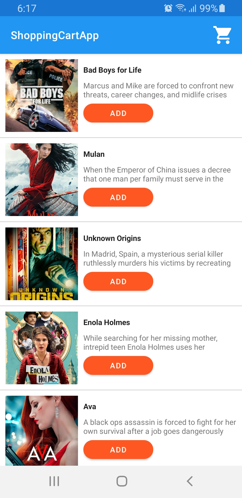
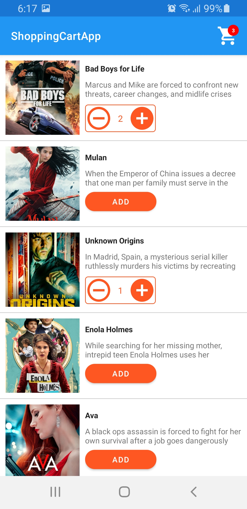
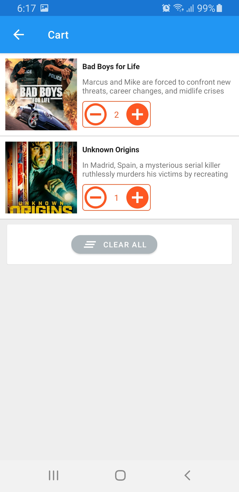
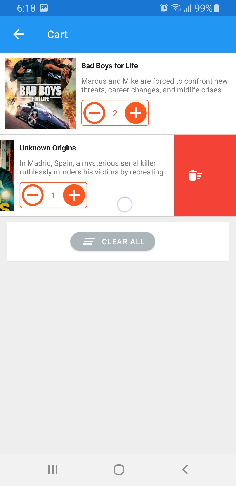
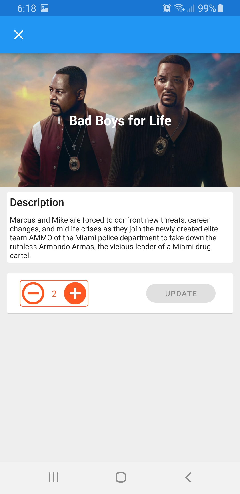
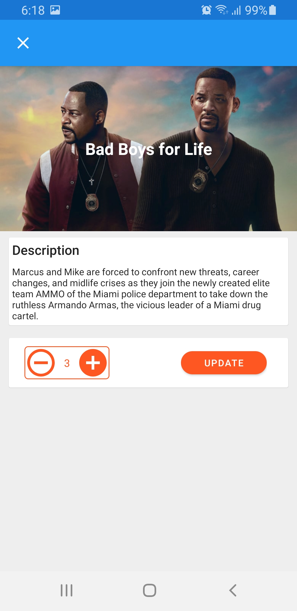

# Shopping Cart #

This application simulates a shopping cart, displaying a list of movies as follows:

### Technical requirements to build the project. ###
------------------------------------

* [AppCompat, CardView, RecyclerView and DesignLibrary](https://developer.android.com/intl/es/tools/support-library/index.html)
* [RxJava & RxAndroid](https://github.com/ReactiveX/RxAndroid)
* [Koin](https://insert-koin.io/)
* [Retrofit](https://square.github.io/retrofit)
* [OkHttp3](https://square.github.io/okhttp/)
* [Moshi](https://github.com/square/moshi)
* [Glide](https://github.com/bumptech/glide)
* [Room](https://developer.android.com/jetpack/androidx/releases/room)
* [The Movie db](https://www.themoviedb.org/documentation/api)
* [Learn More](https://bitbucket.org/RcFlechas/shoppingcartapp/src/master/)

### Architecture ###

#### app ####

Application level implementations.

* di
    - ApplicationModule
    - DataBaseModule
    - RetrofitModule
    - ViewModelModule
* BaseApplication

#### core ####

Global functionality service.

* Extension
* RetrofitFactory

#### models ####

The business layer contains the main data processing logic.

- data
    - local
        - dao
            - CartDAO
            - MovieDAO
        - entities
            - Cart
            - CartWithMovie
            - Movie
            - MovieWithCart
        - DataBases
    - remote
        - api
            - MovieApi
        - requests
        - responses
            - MovieResponse
            - TheMovieDbResponse
        - rest
            - EndPoints
- repositories
    - impl
        - CartRepositoryImpl
        - MovieRepositoryImpl
    - CartRepository     
    - MovieRepository     

#### utilities ####

There are the utilities of the app.

- Event
- UIState
- Utilities

#### viewmodels ####

The layer that contains all the viewmodels.

- CartViewModel
- MovieDetailViewModel
- MovieViewModel

#### views ####

The layer that contains all the classes related to the view.

- adapters
    - CustomAdapter
    - MovieAdapter
- binds
    - CartBind
    - MovieBind
    - MovieWithCartBind
- ui
    - activities
        - MainActivity
    - fragments
        - CartFragment
        - MovieDetailDialogFragment
        - MovieFragment
- widget
    - GlideConfiguration
    - SwipeToDeleteCallback